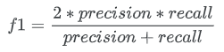
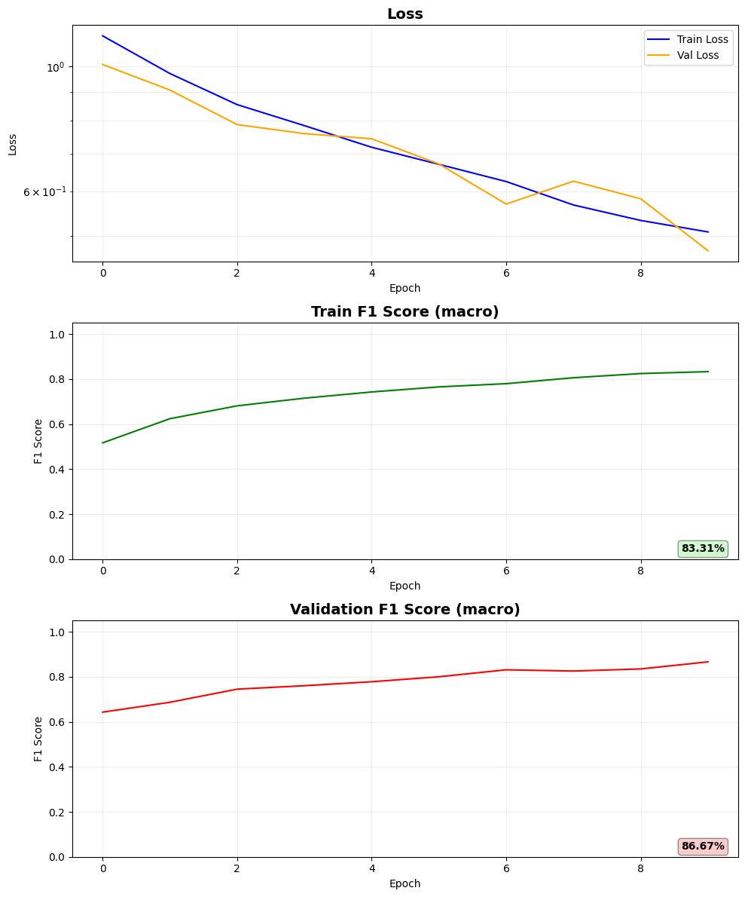

# Распознавание дипфейков с использованием архитектуры XceptionNet
ссылка на соревнования: https://www.kaggle.com/competitions/ml-intensive-yandex-academy-spring-2026

## Описание задачи
В этом проекте я решил задачу бинарной классификации, а именно мне надо было написать модель для распознавания фейковых изображений, сгенерированных с помощью StyleGAN

## Оценка качества модели
Качество решения оценивалось по метрике F1-score:

# Подготовка данных
---

# Архитектура модели
---

# Параметры обучения
---

# Инструкция по запуску
---

# Результаты

